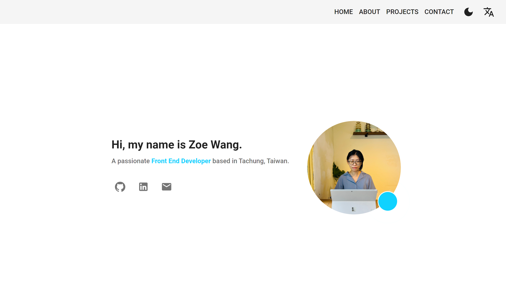
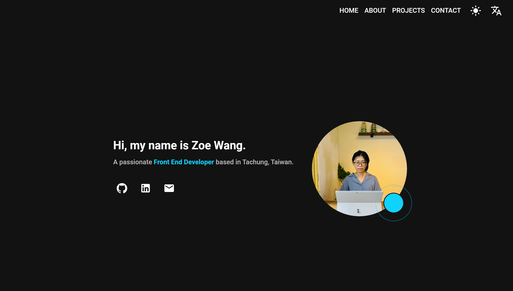

# zoe-personal-portfolio

A Responsive Portfolio Website Using React and Material-UI.

## 試用 Demo

請點擊連結 [https://zoewang7512.github.io/2021-Canada-Travelogue/](https://zoewang7512.github.io/2021-Canada-Travelogue/) 試用 demo


## 畫面截圖

| | | 
|:-------------------------:|:-------------------------:|
| |   |


## 安裝

以下將會引導你如何安裝此專案到你的電腦上。

Node.js 版本建議為：`v20.11.1` 以上...

### 取得專案

```bash
git clone https://github.com/zoewang7512/2021-Canada-Travelogue.git
```

### 移動到專案內

```bash
cd 2021-Canada-Travelogue
```

### 安裝套件

```bash
npm install
```

### 運行專案

```bash
npm start
```
### 發佈專案

```bash
npm run deploy
```

## 專案技術

- Node.js v20.11.1
- react v18.2.0
- react-router-dom v6.22.3
- @mui/material v5.15.15
- i18next v1.7.2

- gh-pages v6.1.1

